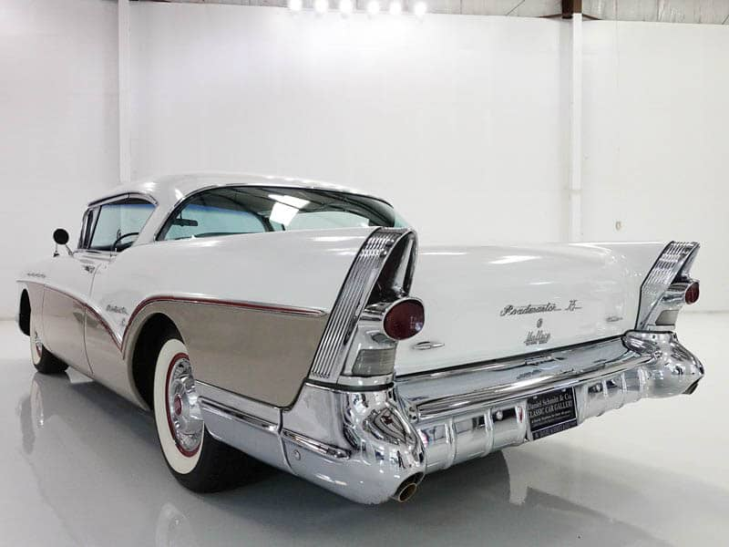
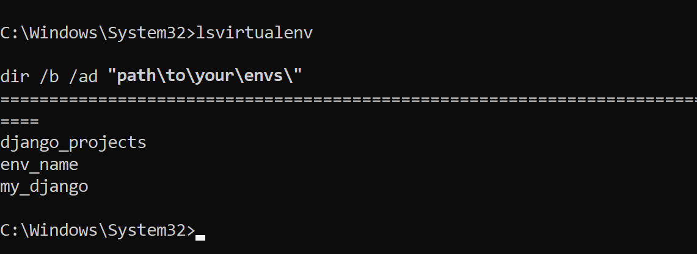
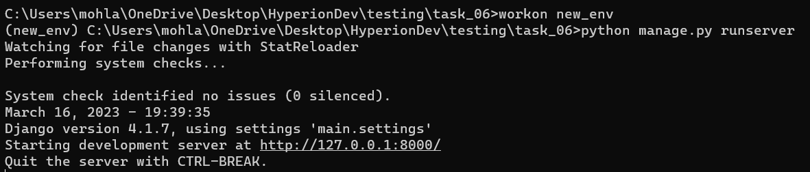
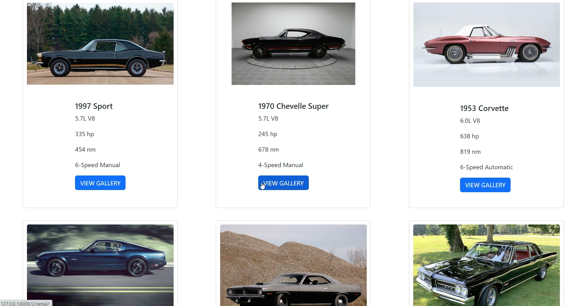
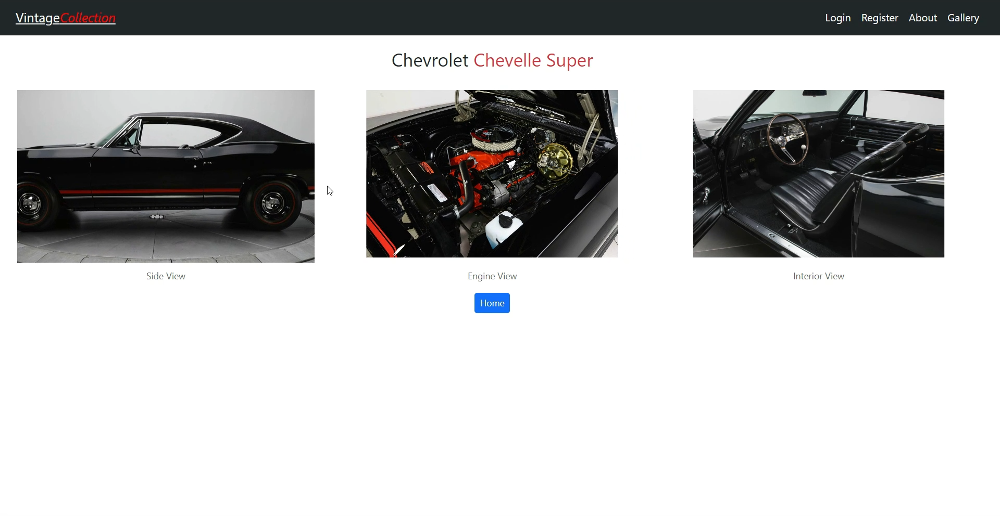
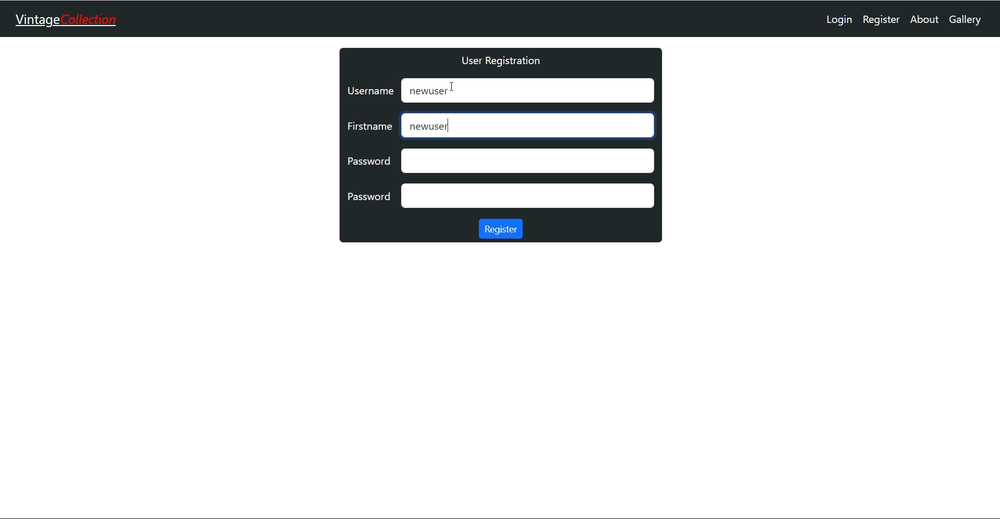

<!-- Heading -->
# <strong>Vintage-Collection</strong>  
<a href="https://github.com/Mutnauq92/Vintage-Collection" target="_blank">VintageCollection Repository</a>  

Gallery of vintage and muscle cars  
The webapp contains a database of vintage cars  
For the love of vintage and muscle cars, enthusiasts  
can find information, eg performance, year models
etc.,  
provided about the cars in the gallery

<br><br><br>

<br><br><br>

# Table of contents <span style="opacity: 0.4"> [ Virtualenv-Wrapper ]</span>

<!-- Ordered list  -->  
1. [Table of Contents](#dockerizing)
1. [Tools](#tools)  
1. [Resources](#resources)  
1. [Python Installation](#python-installation)<br>
1. [Virtual Environment Setup](#virtual-environment)<br>
1. [Django Installation](#django-installation)<br>
1. [Pillow Installation](#pillow-installation)<br>  
1. [Cloning Git Repository](#clone-repository)<br>  
1. [Usage](#usage)  
  
## <strong>Tools</strong>  
<a href="http://python.org" target="_blank">Python</a>  
<a href="https://docs.djangoproject.com/" target="_blank">Django</a>  
  
## Resources  
<a href="https://www.hyperiondev.com" target="_blank">Task Reading Material</a>  
<a href="https://pypi.org/project/virtualenvwrapper-win/">Virtualenv installation docs</a>  
<a href="https://www.youtube.com/watch?v=O5YkEFLXcRg" target="_blank">Codemy.com</a>

## Python-Installation

Download the latest <a href="https://www.python.org/downloads/" target="_blank">Python</a>  
and install on your local machine

Confirm python installation by opening cmd  
Then copy and run the command below
```
python --version
```

If python was installed correctly, the result will be displayed     
as in the image below. The version will differ depending on     
your installed version   


## <strong>Virtual-Environment</strong>
NB!!! <strong>This has only been tested on windows machine</strong>     
Type the command below to install virtualenvwrapper
```
python -m pip install --upgrade pip
python -m pip install virtualenvwrapper-win
```

Create a new virtual environment    
You can name new virtualenv anything you desire
e.g 
```
mkvirtualenv env_name
```
display list of virtualenvs in your machine
```
lsvirtualenv
```
Output should be a summary of created virtual environments      
like the one below


to activate existing virtualenv
```
workon env_name
```

to exit or deactivate virtual env

```
deactivate
```
<br>  

## <strong>Django-Installation</strong> 

with \'cmd' open on windows, type the command
```
workon env_name
python -m pip install django
```

Confirm django installation, by checking installed version
```
python -m django --version
```
<br>  

## <strong>Pillow-Installation</strong>  

This package is used for image processing  
To install pillow, copy and run the command below  
```
python -m pip install Pillow
```  
Copy and run commands below to check Pillow version  
```
workon env_name
pip show Pillow
```
close cmd  

[top](#table-of-contents)  
<br>  

## <strong>Clone-Repository</strong>  

To clone the vintagecollection repo, you will need  
to download [<strong>GIT</strong>](https://git-scm.com/download/win), and select the version appropriate for your OS.    
Install git and run it.     
1. Open the folder you want to run the project from.
1. Right click and run cmd from there   
1. Copy and run the commands below, one at a time   
 to clone the repository and navigate to a folder containing    
 necessary files to run the project.

```
git clone https://github.com/Mutnauq92/Vintage-Collection
cd Vintage-Collection
```

Now, repository cloning is complete and the project is ready to run.    
Run the following command

```
workon env_name
python manage.py runserver
```
If all steps were followed, you should see the results similar to   
the following



From inside cmd, press Ctrl and left click on the   
localhost link to open the webapp from your default browser.  
[top](#table-of-contents)  
  
## <strong>Usage</strong>  
Administrative Login details  
**username**: admin  
**password**: admin  
  
## Main Gallery  

<br>  

## Car Menu  
  
<br>  
  
## User Registration

  
[top](#table-of-contents)  

<br>  

# Dockerizing <span style="opacity: 0.4"> [ Virtualenv-Wrapper ]</span>  

1. Create a <a href="https://hub.docker.com/signup">docker</a> account  
    if you already have one, <a href="https://hub.docker.com/login">login</a>
1. Open <a href="https://labs.play-with-docker.com/">Docker Play</a> online docker playground.  
    login and press <a href="https://www.google.com"><button style="height:30px;background:green">START</button></a>  

1. Click on '+ ADD NEW INSTANCE'  

1. Once in the terminal, enter command:
    ```
    docker pull mohapi007/vintagecollection
    ```  

1. Now type the following command and press enter  
    ```
    docker run --publish 8000:8000 mohapi007/vintagecollection
    ```  

1. Click on port: '<span style="color:orange;">8000</span>' displayed on top of the page, to open vintage-collection in browser.

<br>  

# Enjoy !!!
